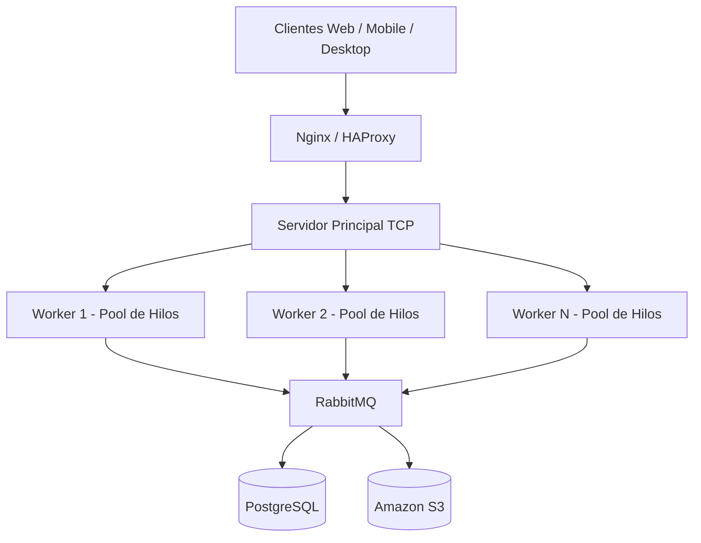

# PFO 3 - Sistema Distribuido de Gestión de Tareas

## Descripción

Rediseño distribuido del sistema de gestión de tareas del PFO 2 utilizando sockets TCP.

La arquitectura implementa:

- Cliente TCP
- Servidor principal
- Balanceo Round Robin
- Workers concurrentes
- Pool de hilos
- Persistencia SQLite
- Arquitectura distribuida

---

# Arquitectura



---

# Estructura

```text
pfo_03/
│
├── client.py
├── server.py
├── worker.py
├── database.py
├── init_db.py
├── requirements.txt
└── README.md
```

---

# Ejecución

## 1. Inicializar base de datos

```bash
python init_db.py
```

---

## 2. Iniciar servidor principal

```bash
python server.py
```

---

## 3. Iniciar workers

```bash
python worker.py --name worker-1
```

```bash
python worker.py --name worker-2
```

---

## 4. Ejecutar cliente

```bash
python client.py
```

---

# Funcionalidades

- Registro de usuarios
- Login
- Crear tareas
- Ver tareas
- Eliminar tareas
- Distribución de requests
- Workers concurrentes
- Sistema multicliente
- Arquitectura distribuida

---

# Tecnologías

- Python 3
- socket
- threading
- concurrent.futures
- sqlite3
- json

---


# Explicación del funcionamiento del sistema

Este proyecto es una evolución del sistema de gestión de tareas desarrollado anteriormente, pero rediseñado con una arquitectura distribuida utilizando sockets TCP en Python.

El sistema está compuesto por:

- un cliente TCP,
- un servidor principal,
- múltiples workers,
- y una base de datos SQLite.

Cuando un cliente realiza una solicitud, el servidor principal la recibe y la distribuye entre los workers utilizando Round Robin para balancear la carga.

Cada worker utiliza un pool de hilos (ThreadPoolExecutor) para poder procesar múltiples solicitudes al mismo tiempo de manera concurrente.

La comunicación entre los componentes se realiza mediante sockets TCP y mensajes en formato JSON.

El objetivo principal del proyecto fue aplicar conceptos de:

- arquitectura cliente-servidor,
- concurrencia,
- programación multihilo,
- balanceo de carga,
- sockets TCP,
- y sistemas distribuidos.


---

# Autor

Román Ríos

---

Instituto de Formación Técnica Superior N° 29  

Tecnicatura Superior en Desarrollo de Software  

Año 2026
