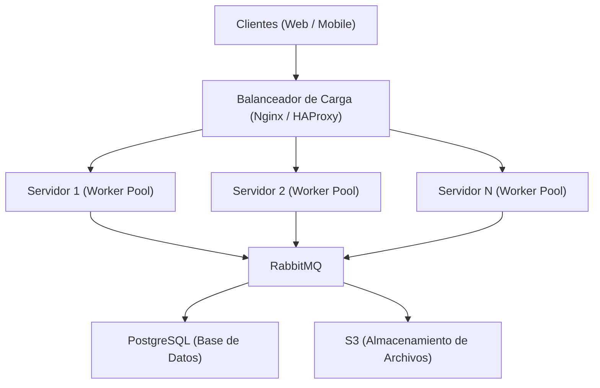

# Arquitectura distribuida con sockets

## 1) Diagrama del sistema



### Qué representa

- **Clientes**: entran por HTTP/WebSocket o por socket según el caso.
- **Balanceador**: reparte peticiones entre varios servidores de aplicación.
- **Servidores**: reciben tareas, las enrutan y coordinan el trabajo.
- **RabbitMQ**: desacopla servidores y workers cuando se necesita comunicación asíncrona.
- **Workers**: ejecutan las tareas usando un **pool de hilos**.
- **PostgreSQL / S3**: guardan datos estructurados y archivos.

## 2) Ejecución del ejemplo

Este ejemplo implementa:

- un **servidor TCP** que recibe tareas por socket,
- un **worker TCP** que procesa tareas,
- un **cliente TCP** que envía tareas y recibe resultados.

### Levantar el sistema

1. Abrir una terminal y ejecutar el servidor:

   ```bash
   python server.py
   ```

2. Abrir una o más terminales y ejecutar workers:

   ```bash
   python worker.py --name worker-1
   python worker.py --name worker-2
   ```

3. En otra terminal, enviar una tarea:
   ```bash
   python client.py --operation factorial --value 5
   ```

## 3) Formato del mensaje

El protocolo usa JSON sobre TCP con una línea por mensaje.

Ejemplo de tarea:

```json
{
  "task_id": "uuid",
  "operation": "factorial",
  "value": 5
}
```

Ejemplo de respuesta:

```json
{
  "task_id": "uuid",
  "ok": true,
  "worker": "worker-1",
  "result": 120
}
```
