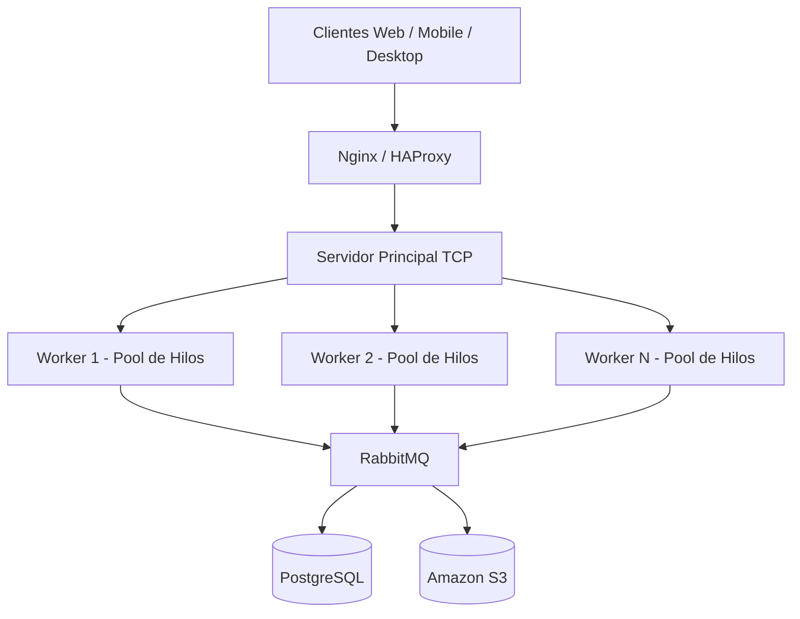

# PFO 3 - Sistema Distribuido Cliente-Servidor

## Descripción

Sistema distribuido implementado en Python utilizando sockets TCP.

La arquitectura incluye:

- Cliente TCP
- Servidor principal
- Workers concurrentes
- Distribución de tareas
- Pool de hilos
- Arquitectura distribuida

---

# Arquitectura



---

# Estructura

```text
pfo_03/
│
├── client.py
├── server.py
├── worker.py
├── requirements.txt
└── README.md
```

---

# Ejecución

## 1. Iniciar servidor

```bash
python server.py
```

---

## 2. Iniciar workers

```bash
python worker.py --name worker-1
```

```bash
python worker.py --name worker-2
```

---

## 3. Ejecutar cliente

### Factorial

```bash
python client.py --operation factorial --value 5
```

### Fibonacci

```bash
python client.py --operation fibonacci --value 10
```

### Suma

```bash
python client.py --operation add --value "[1,2,3,4]"
```

### Multiplicación

```bash
python client.py --operation multiply --value "[2,3,4]"
```

### Upper

```bash
python client.py --operation upper --value hola
```

### Reverse

```bash
python client.py --operation reverse --value hola
```

---

# Funcionalidades

- Comunicación mediante sockets TCP
- Distribución de tareas entre workers
- Round Robin
- Workers concurrentes
- Pool de hilos
- JSON como protocolo
- Arquitectura distribuida
- Sistema multicliente

---

# Tecnologías

- Python 3
- socket
- threading
- concurrent.futures
- json
- uuid

---

# Autor

Román Ríos